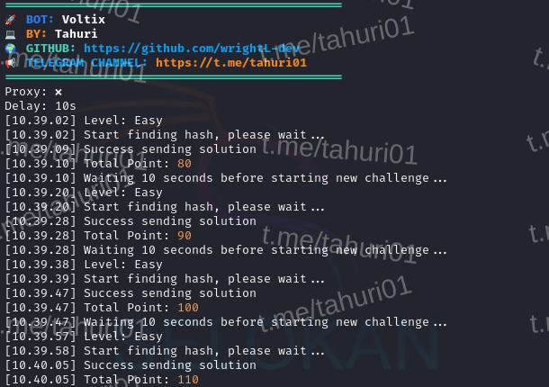

# BOT VOLTIX AI



**Fitur:**

**• Auto Connect**

**• Custom Level**

**• Supports Proxy w/o Proxy**

## Requirements

Before running this project, make sure you have installed:

- Node.js v22.14.0
- npm (Node Package Manager)
- nvm (Node Version Manager)

## Installation

1. **Run the script:**
   ```plaintext
   bash setup.sh

Note: After install exit ssh if you using vps

2. **Add token in the token.txt file. Example:**

    ```plaintext
    eyxxxxxxxxxx

3. **If you want to use a proxy, edit the proxy.txt file. Example:**
   ```plaintext
   http://username:password@ip_address:port

4. **If you want change level and delay, edit the config.json file. Example:**
   ```plaintext
   Level: Easy, Normal, Hard
   {
    "level":"Easy",
    "delay":10000
   }

6. **Run the script:**

   For VPS/Linux System:
   ```plaintext
   node main.js
   ```
    For RDP/Windows System:
   ```plaintext
   node main_win64.js
   ```
   For userLand: 
   ```plaintext
   node main_arm64.js
   ````

## Support

If you have any questions or need further assistance, feel free to join our Telegram channel at [t.me/tahuri01](https://t.me/tahuri01).

## License

This project is licensed under the [MIT License](LICENSE).
